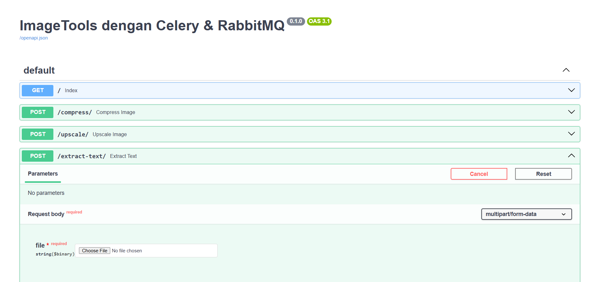
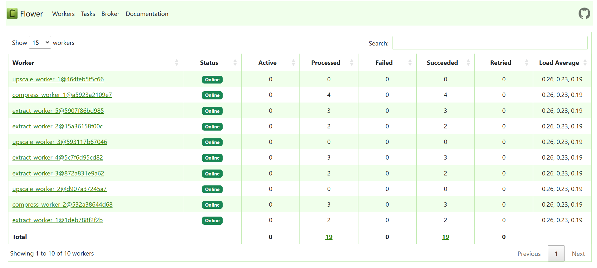
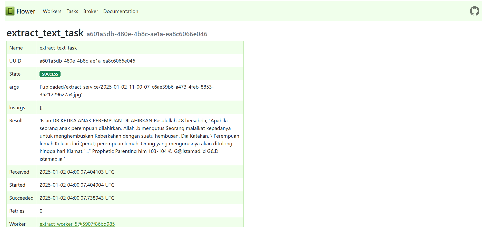
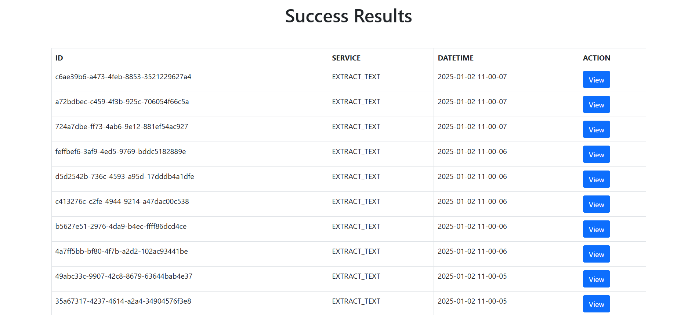
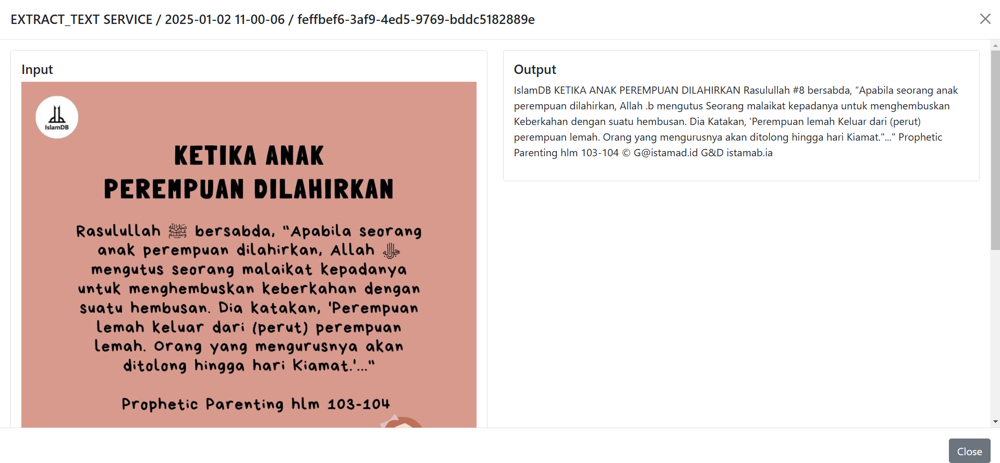

# ImageTools

**ImageTools** adalah layanan seperti iLoveIMG yang dirancang untuk memudahkan pengolahan gambar dengan berbagai fungsi, termasuk kompresi, peningkatan resolusi, dan ekstraksi teks. Dengan menggunakan ImageTools, pengguna dapat dengan mudah mengelola dan memanipulasi gambar sesuai kebutuhan.

## Fitur Utama

- **Kompresi Gambar**: Mengurangi ukuran file gambar tanpa mengorbankan kualitas secara signifikan.
- **Peningkatan Resolusi**: Meningkatkan kualitas gambar dengan memperbesar resolusi gambar.
- **Ekstraksi Teks**: Mengambil teks dari gambar menggunakan Optical Character Recognition (OCR).

## Table 2: Aspek Teknis Sistem

| Aspek                                                         | Deskripsi                                                                                                                                                                                                                                                                                                    |
|---------------------------------------------------------------|--------------------------------------------------------------------------------------------------------------------------------------------------------------------------------------------------------------------------------------------------------------------------------------------------------------|
| Studi Kasus                                                   | **ImageTools** adalah layanan seperti iLoveIMG yang dirancang untuk memudahkan pengolahan gambar dengan berbagai fungsi, termasuk kompresi, peningkatan resolusi, dan ekstraksi teks. Dengan menggunakan ImageTools, pengguna dapat dengan mudah mengelola dan memanipulasi gambar sesuai kebutuhan. |
| Pekerjaan (task)                                              | 1. Compress Image    2. Upscale Image    3. Extract Text                                                                                                                                                                                                                                               |
| Moda komunikasi                                               | Message queue                                                                                                                                                                                                                                                                                                |
| Moda message queue                                            | RabbitMQ Exchanges, routing keys and bindings                                                                                                                                                                                                                                                                |
| Moda alokasi pekerjaan                                        | Celery                                                                                                                                                                                                                                                                                                       |
| Application protocol                                          | HTTP with API                                                                                                                                                                                                                                                                                                |
| Platform untuk broker                                         | RabbitMQ                                                                                                                                                                                                                                                                                                     |
| Platform untuk job queue                                      | Celery                                                                                                                                                                                                                                                                                                       |
| Library queue broker                                          | Kombu (karena Celery menggunakan Kombu)                                                                                                                                                                                                                                                                      |
| Antarmuka sistem pada activity 2 dan 4 (no. 4 dan 6, Tabel 1) | FastAPI untuk no. 4 dan Flower untuk no. 6 dalam Tabel 1                                                                                                                                                                                                                                                     |
| Melihat luaran pekerjaan pada activity 5 (no. 7, Tabel 1)                     | Standalone web dengan menggunakan Flask untuk menampilkan semua task yang sukses                                                                                                                                                                                                                             |
| Environment setup                                             | Docker                                                                                                                                                                                                                                                                                                       |

## Alokasi Jumlah Worker Setiap Layanan

Dilakukan beberapa percobaan dengan mengukur waktu eksekusi yang dibutuhkan di setiap layanan dengan asumsi penggunaan layanan yang merata. Kami membatasi maksimal jumlah worker adalah 10 worker dan setiap layanan harus memiliki minimal 2 worker. Kemudian didapatkan hasil sebagai berikut ini.

### Rata-rata Waktu Eksekusi
- **Compress Image**: 0.015 detik
- **Upscale Image**: 0.065 detik
- **Extract Text**: 0.385 detik

### Total Worker yang Tersedia
- **Total Worker**: 10 worker
- **Minimal Worker per Layanan**: 2 worker

### Langkah-langkah Pembagian Worker

1. **Alokasikan minimal 2 worker untuk setiap layanan**:
   - Compress Image: 2 worker
   - Upscale Image: 2 worker
   - Extract Text: 2 worker

   **Total worker yang dialokasikan**: 2 + 2 + 2 = 6

2. **Sisa worker**: 

   Sisa Worker = 10 - 6 = 4 worker

3. **Hitung proporsi untuk sisa worker**:
   - Total waktu eksekusi: 

     - 0.015 + 0.065 + 0.385 = 0.465 detik

   - Hitung proporsi berdasarkan waktu eksekusi:
     - Compress Image: 0.015 / 0.465 = 0.0322
     - Upscale Image: 0.065 / 0.465 = 0.1398
     - Extract Text: 0.385 / 0.465 = 0.8280

4. **Alokasi sisa worker**:
   - Total proporsi: 0.0322 + 0.1398 + 0.8280 = 1
   - Alokasikan sisa worker (4 worker) berdasarkan proporsi:
     - Compress Image:
       - 4 * 0.0322 = 0.1288 (dibulatkan menjadi 0)
     - Upscale Image:
       - 4 * 0.1398 = 0.5592 (dibulatkan menjadi 1)
     - Extract Text:
       - 4 * 0.8280 = 3.3120 (dibulatkan menjadi 3)

### Pembagian Worker Akhir
- **Compress Image**: 2 worker
- **Upscale Image**: 3 worker
- **Extract Text**: 5 worker

### Pemenuhan Kriteria Implementasi

**ImageTools** telah memenuhi semua kriteria yang ditetapkan dalam Tabel 1 sebagai berikut:

1. **Poin 3: Membuat pekerjaan baru ke dalam antrian.**
   - Sistem memungkinkan pengguna untuk mengunggah gambar dan memilih jenis pekerjaan (kompresi, peningkatan resolusi, ekstraksi teks) yang dimasukkan ke dalam antrian RabbitMQ dan telah diatur Celery dengan custom exchange, queue, dan binding (route).

2. **Poin 4: Mendefinisikan jenis pekerjaan untuk tiap antrian.**
   - Jenis pekerjaan yang tersedia telah didefinisikan secara hardcoded, termasuk kompresi gambar, peningkatan resolusi, dan ekstraksi teks yang dikemas dalam FastAPI.
   - Dapat diakses pada http://localhost:8000/docs
   - 

3. **Poin 5: Menjalankan/eksekusi proses komputasi.**
   - Celery telah digunakan untuk mengeksekusi pekerjaan secara asinkron berdasarkan antrian yang ada.

4. **Poin 6: Memantau status pekerjaan dalam antrian.**
   - Status pekerjaan dapat dipantau menggunakan Flower, yang dapat melihat seluruh status pekerjaan yang pernah masuk dalam antrian.
   - Dapat diakses pada http://localhost:5555/ dan untuk RabbitMQ management dapat diakses di http://localhost:15672/
   - 
   - 

5. **Poin 7: Melihat hasil pekerjaan yang sukses dijalankan.**
   - Hasil pekerjaan yang berhasil dapat diakses melalui antarmuka web yang dibangun dengan Flask, memungkinkan untuk melihat pekerjaan yang sukses.
   - Dapat diakses pada http://localhost:5000/
   - 
   - 

Itu semua dilakukan dengan moda komunikasi message queue dengan custom alokasi worker dan juga custom untuk RabbitMQ exchange, queue, dan binding (route) menggunakan Kombu Celery.